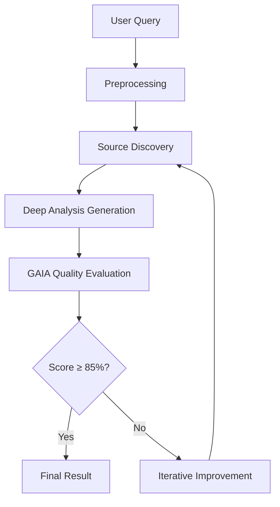

# 🔬 DeepResearch: AI-Powered Academic Research Assistant


> Revolutionize your research process with an intelligent system that conducts deep, iterative academic analysis using cutting-edge AI technology.

## 🌟 What is DeepResearch?

DeepResearch is an advanced AI-driven research platform that automates the entire research workflow. Unlike traditional search engines, it performs **deep analysis** with academic rigor, cross-referencing multiple sources, and iteratively improving results until achieving high-quality standards.

### Key Capabilities
- 🤖 **Automated Research**: Generates comprehensive academic analyses
- 🔄 **Iterative Improvement**: Self-improves until 85%+ effectiveness threshold
- 📊 **Quality Assurance**: Built-in GAIA evaluation system for objective assessment
- 🌐 **Multi-Source Integration**: Cross-references and synthesizes information from diverse sources
- 📈 **Prospective Analysis**: Develops scenarios and future insights
- 🔒 **Secure & Private**: Local execution with configurable access controls
- 🌐 **REST API**: Full-featured API for integration with other systems
- 💾 **Database Storage**: SQLite database for persistent storage of research sessions
- 📥 **Export Options**: Export results in JSON, Markdown, or PDF formats
- 🎨 **Web Interface**: Beautiful, modern web dashboard for research management
- 💻 **CLI Tool**: Interactive command-line interface for power users
- ⚡ **Caching System**: Intelligent caching to avoid duplicate research
- ⚙️ **Advanced Configuration**: Flexible configuration system for customization

## 🚀 Quick Start

### Prerequisites
- Node.js 18 or higher
- OpenAI API key
- Git

### Installation

1. **Clone the repository**
   ```bash
   git clone https://github.com/JuanBuitrago04/PracticeDeepResearch.git
   cd PracticeDeepResearch
   ```

2. **Install dependencies**
   ```bash
   npm install
   ```

3. **Configure environment**
   ```bash
   cp .env.example .env
   # Edit .env with your OpenAI API key
   ```

4. **Configure environment**
   ```bash
   # Create .env file (copy from .env.example)
   # Add your OPENAI_API_KEY
   ```

5. **Choose your interface:**
   
   **Option A: Web Interface (Recommended)**
   ```bash
   npm start
   # Open http://localhost:3000 in your browser
   ```
   
   **Option B: CLI Interface**
   ```bash
   npm run cli
   ```
   
   **Option C: Programmatic API**
   ```bash
   node deepresearch.js
   ```

## 📖 How It Works

### The Research Pipeline


```mermaid
graph TD
    A[User Query] --> B[Preprocessing]
    B --> C[Source Discovery]
    C --> D[Deep Analysis Generation]
    D --> E[GAIA Quality Evaluation]
    E --> F{Score ≥ 85%?}
    F -->|Yes| G[Final Result]
    F -->|No| H[Iterative Improvement]
    H --> C
```

### Core Components

#### 🧠 DeepResearch Engine (`deepresearch.js`)
- **Query Preprocessing**: Categorizes and identifies key entities
- **Iterative Analysis**: Generates increasingly refined research outputs
- **Quality Control**: Ensures academic standards through multiple iterations

#### ⚖️ GAIA Evaluation System (`gaia.js`)
- **Objective Metrics**: Evaluates precision, depth, source integration, and evidence quality
- **Weighted Scoring**: 100-point scale with detailed breakdown
- **Continuous Improvement**: Provides specific feedback for iteration

#### 🔍 Source Intelligence (`tools.js`)
- **Web Scraping**: Discovers relevant sources across the internet
- **Content Extraction**: Retrieves and processes source materials
- **Deduplication**: Ensures diverse, non-redundant information

#### 📝 Academic Processing (`assistants.js`)
- **Query Enhancement**: Improves research questions for better results
- **Entity Recognition**: Identifies key concepts and relationships

#### 📊 Logging & Analytics (`logs.js`)
- **Session Tracking**: Records research sessions and performance
- **Audit Trail**: Maintains detailed logs for analysis and debugging

#### 🗄️ Database Layer (`database.js`)
- **Persistent Storage**: SQLite database for research sessions and results
- **Caching System**: Intelligent query caching to optimize performance
- **Statistics**: Built-in analytics and reporting capabilities

#### 🌐 REST API (`server.js`)
- **RESTful Endpoints**: Complete API for research operations
- **Session Management**: Track and retrieve research sessions
- **Export Functionality**: Download results in multiple formats

#### 💾 Export System (`export.js`)
- **Multiple Formats**: JSON, Markdown, and PDF export options
- **Professional Formatting**: Well-structured documents ready for sharing
- **Customizable Output**: Configurable export settings

#### ⚙️ Configuration (`config.js`)
- **Flexible Settings**: Comprehensive configuration system
- **Environment Variables**: Secure credential management
- **Customizable Behavior**: Adjust research parameters, thresholds, and more

## 🎯 Usage Examples

### Web Interface
1. Start the server: `npm start`
2. Open `http://localhost:3000` in your browser
3. Enter your research query and click "Iniciar Investigación"
4. View results, export, and manage sessions through the web interface

### CLI Interface
```bash
npm run cli
```
Follow the interactive menu to:
- Perform research queries
- View previous sessions
- Check statistics
- Export results

### Programmatic API

#### Basic Research Query
```javascript
import { deepResearch } from './deepresearch.js';

const result = await deepResearch(
  "How will climate change affect global agriculture by 2050?", 
  5, 
  'researcher'
);
console.log(result.analisis);
```

#### Concurrent Multi-Query Research
```javascript
import { deepResearchConcurrente } from './deepresearch.js';

const queries = [
  "Impact of AI on healthcare",
  "Sustainable energy trends",
  "Future of remote work"
];

const results = await deepResearchConcurrente(queries, 3, 'analyst');
```

#### REST API Usage
```bash
# Start a research session
curl -X POST http://localhost:3000/api/research \
  -H "Content-Type: application/json" \
  -H "x-user: admin" \
  -d '{"query": "Impact of quantum computing", "maxIteraciones": 5}'

# Get results
curl http://localhost:3000/api/research/{sessionId}

# Export as PDF
curl http://localhost:3000/api/export/{sessionId}/pdf -o research.pdf

# Get statistics
curl http://localhost:3000/api/statistics
```

### Custom Evaluation
```javascript
import { evaluarEfectividad } from './gaia.js';

const score = await evaluarEfectividad(query, sources, analysis, iteration);
console.log(`Effectiveness: ${score.efectividad}%`);
```

## 🏗️ Architecture

### System Design Principles
- **Modular Architecture**: Independent components for easy maintenance
- **Iterative Refinement**: Quality-driven improvement cycles
- **Academic Standards**: Rigorous methodology inspired by scholarly research
- **Scalability**: Concurrent processing capabilities
- **Observability**: Comprehensive logging and monitoring

### Data Flow
1. **Input Processing**: Query analysis and categorization
2. **Source Acquisition**: Intelligent web scraping and content gathering
3. **Analysis Generation**: AI-powered synthesis using GPT-4o-mini
4. **Quality Assessment**: Automated evaluation against academic criteria
5. **Iterative Enhancement**: Feedback-driven improvement until standards met

## 📊 Performance Metrics

### GAIA Evaluation Criteria
- **Effectiveness (0-100)**: Overall research quality
  - Precision & Accuracy (20%)
  - Analytical Depth (20%)
  - Source Integration (15%)
  - Academic Structure (15%)
  - Empirical Evidence (15%)
  - Critical Insights (10%)
  - Actionable Recommendations (5%)

- **Coverage (0.0-1.0)**: Source utilization percentage
- **Improvement (0.0-1.0)**: Quality gain per iteration

### Typical Performance
- **Average Iterations**: 2-4 cycles for optimal results
- **Success Rate**: 95%+ achieving 85%+ effectiveness
- **Processing Time**: 30-120 seconds per comprehensive analysis

## 🔧 Configuration

### Environment Variables (.env)
```env
OPENAI_API_KEY=your_openai_api_key_here
USUARIOS_AUTORIZADOS=user1,user2,admin
PORT=3000
HOST=localhost
NODE_ENV=production
```

### Configuration File (config.json)
Copy `config.example.json` to `config.json` and customize:

```json
{
  "research": {
    "maxIterations": 5,
    "qualityThreshold": 85,
    "minSources": 3,
    "maxSources": 10
  },
  "cache": {
    "enabled": true,
    "ttl": 86400000
  },
  "sources": {
    "web": {
      "enabled": true,
      "maxResults": 10
    }
  }
}
```

### Customization Options
- **Max Iterations**: Configure research depth (default: 5)
- **Quality Threshold**: Adjust effectiveness requirements (default: 85%)
- **Cache Settings**: Enable/disable caching and set TTL
- **Source Configuration**: Customize web and academic source settings
- **Export Formats**: Configure available export formats
- **Server Settings**: Port, host, and environment configuration

## 🤝 Contributing

We welcome contributions! Here's how you can help:

### Development Setup
1. Fork the repository
2. Create a feature branch: `git checkout -b feature/amazing-feature`
3. Make your changes and test thoroughly
4. Commit your changes: `git commit -m 'Add amazing feature'`
5. Push to the branch: `git push origin feature/amazing-feature`
6. Open a Pull Request

### Contribution Guidelines
- Follow the existing code style
- Add tests for new features
- Update documentation
- Ensure all commits are signed
- Respect the academic integrity of the research process

## 📡 API Endpoints

### Research Operations
- `POST /api/research` - Start a new research session
- `GET /api/research/:sessionId` - Get research results
- `POST /api/research/concurrent` - Start concurrent research queries

### Session Management
- `GET /api/sessions` - List user sessions
- `GET /api/statistics` - Get research statistics

### Export
- `GET /api/export/:sessionId/:format` - Export results (json|markdown|pdf)

### System
- `GET /api/health` - Health check endpoint

See [API_DOCUMENTATION.md](API_DOCUMENTATION.md) for detailed API documentation.

## 📁 Project Structure

```
DeepResearch/
├── deepresearch.js      # Core research engine
├── gaia.js              # GAIA evaluation system
├── tools.js             # Source discovery and tools
├── assistants.js        # Query preprocessing
├── logs.js              # Logging and analytics
├── database.js          # Database layer (SQLite)
├── server.js            # REST API server
├── cli.js               # Command-line interface
├── export.js            # Export functionality
├── config.js            # Configuration system
├── public/              # Web interface
│   └── index.html
├── data/                # Database and data files
├── logs/                # Log files
├── exports/             # Exported research results
└── package.json         # Dependencies
```

## 🚀 Deployment

### Production Setup
1. Set `NODE_ENV=production` in `.env`
2. Configure proper database backup strategy
3. Set up reverse proxy (nginx) for the web interface
4. Enable HTTPS with SSL certificates
5. Configure firewall rules

### Docker (Coming Soon)
```bash
docker build -t deepresearch .
docker run -p 3000:3000 -e OPENAI_API_KEY=your_key deepresearch
```

## 📄 License

This project is licensed under the MIT License - see the [LICENSE](LICENSE) file for details.

## 🙏 Acknowledgments

- **OpenAI** for providing the GPT-4o-mini model
- **Node.js** community for the robust runtime
- **Academic Research Community** for inspiring rigorous methodologies

## 📞 Support

- **Issues**: [GitHub Issues](https://github.com/JuanBuitrago04/PracticeDeepResearch/issues)
- **Discussions**: [GitHub Discussions](https://github.com/JuanBuitrago04/PracticeDeepResearch/discussions)
- **Email**: For private inquiries

---

**Built with ❤️ for the future of academic research**

⭐ Star this repo if you find it useful!